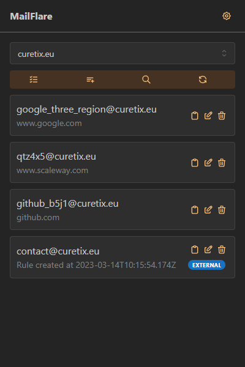
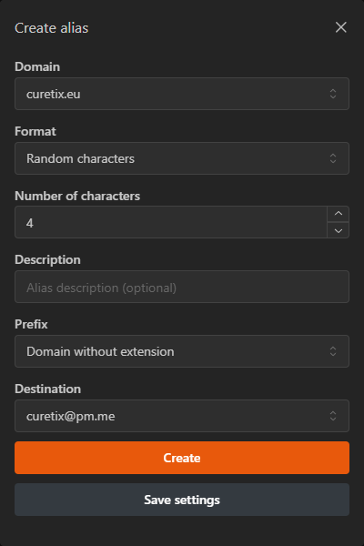
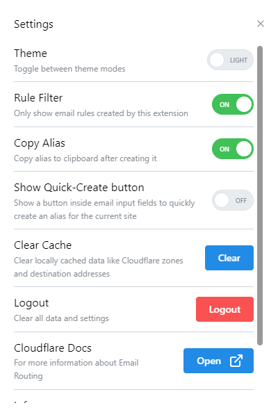

# Cloudflare Email Extension

This extension provides an easy way to turn [Cloudflare Email Routing](https://developers.cloudflare.com/email-routing/)
into your own private email alias service, similar to AnonAddy, SimpleLogin, and others.
No third-party services or tedious configuration of a self-hosted email server needed.

## Screenshots

## Features

- Create / edit / delete aliases, edit / delete aliases in bulk
- Multiple formats for alias addresses (random characters, random words, custom), optionally prefixed with current website name

## Potential future features

- Search aliases
- Create / delete destination addresses
- One-Click alias generation directly inside email input fields
- Advanced login options, manually providing account ID and zone IDs to further limit the API token permissions
- Email Reply worker (see below)

## Limitations

See [this page](https://developers.cloudflare.com/email-routing/known-limitations):

- "Email Routing does not forward non-delivery reports to the original sender. This means the sender will not receive a notification indicating that the email did not reach the intended destination."
- "Subdomains cannot use Email Routing to forward emails, unless they are part of an Enterprise account."
- "Email Routing does not support sending or replying from your Cloudflare domain."

On top of that, further limits might exist but are not stated by Cloudflare.
For example, one community forum post claims that you cannot create more than 200 email rules
(which the extension uses for aliases).

## Create a Cloudflare API token

1. Create a Cloudflare account, add the domain(s) you want to use and enable Email Routing for the domain(s)
2. Go to [this page](https://dash.cloudflare.com/profile/api-tokens)
3. Click "Create Token"
4. Select "Create Custom Token"
5. Choose a name, like "Email Extension"
6. Configure the following permissions (explained in the next section):
    - Account | Email Routing Addresses | Read
    - Zone | Email Routing Rules | Edit
    - Zone | Zone | Read
7. Set "Account Resources" to your account
8. Set "Zone Resources" to "All zones" or select the zone you want to use
9. Configure "Client IP Address Filtering" and "TTL" if you want to
10. Click "Continue to summary" and then "Create token"
11. Copy the generated API key

Your API key is stored locally in your browser and is used to directly communicate with the Cloudflare API.

### Permissions explained

* **Account | Email Routing Addresses | Read** - Listing of destination email addresses
* **Zone | Email Routing Rules | Edit** - Listing, creating, editing and deleting of email rules (aliases)
* **Zone | Zone | Read** - Listing of all the zones in your Cloudflare account (or the zone you select in the "Zone Resources" section)

## Build instructions
1. Install NodeJS (the automated build workflow uses NodeJS version 18) and yarn (with `npm install -g yarn`)
2. Clone the repository: `git clone https://github.com/curetix/mailflare-extension`
3. Install the dependencies: `yarn install`
4. Run the build command: `yarn build` (for Chromium / Manifest V3), `yarn build:firefox` (for Firefox / Manifest V2)
5. The output will be in the folder `build/chrome-mv3-prod` or `build/firefox-mv2-prod`

Loading the extension:

* Chrome
  1. Go to Settings -> Extensions
  2. Enable the **Developer mode** toggle (top right)
  3. Click **Load unpacked** and select the folder of the built extension
* Firefox
  1. Enter `about:debugging` into the address bar
  2. Click **This Firefox**
  3. Click **Load Temporary Add-On...**
  4. Navigate to the folder of the built extension and select the `manifest.json` file
  5. (This will have to be repeated every time Firefox launches)

## Sending from alias using Email Worker

**This is a purely an idea at the moment, it has not been tested!**

Email alias services like SimpleLogin and AnonAddy allow their users to reply to emails received from their alias addresses while keeping the users main email private.
[Here is a nice explanation](https://anonaddy.com/help/replying-to-email-using-an-alias/) on how this works.

While this is [not possible](https://developers.cloudflare.com/email-routing/known-limitations/#sending-or-replying-to-an-email-from-your-cloudflare-domain) directly with Cloudflare Email Routing,
we can combine a catch-all address, an Email Worker, and an external API service like Mailjet for sending emails to achieve something similar like this.

Let's say you have the alias **john@doe.net** for your private address **johndoe@gmail.com**. You receive an email from **alice@example.com** and want to reply using your alias address.
Instead of replying directly to **alice@example.com**, you would use the address **john+alice=example.com@doe.net**.
Since you do not have a rule matching this configured, it is processed by a catch-all Email Worker. It parses the address into sender and receiver (**john@doe.net** and **alice@example.com**),
checks if **john@doe.net** is actually an alias, and forwards the email using an external API like Mailjet (which of course has to be configured for the domain **doe.net**).
Finally, **alice@example.com** will receive a reply to her email from **john@doe.net** instead of your private email address **johndoe@gmail.com**.

## Built with

* [Plasmo](https://github.com/PlasmoHQ/plasmo)
* [React](https://github.com/facebook/react)
* [Mantine UI](https://github.com/mantinedev/mantine)
* [TanStack Query](https://github.com/TanStack/query)
